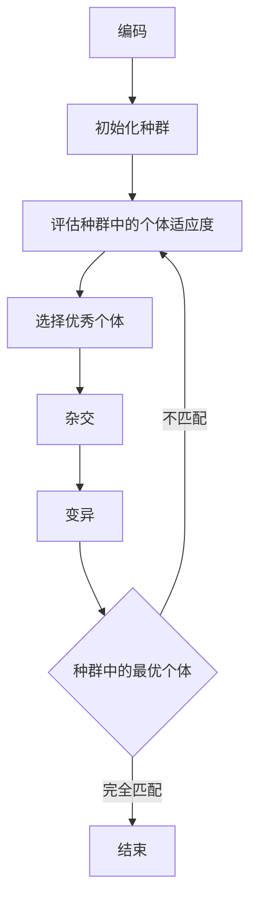

# 遗传算法


> 遗传算法（Genetic Algorithm，GA）最早是由美国的 John holland于20世纪70年代提出,该算法是根据大自然中生物体进化规律而设计提出的。是模拟达尔文生物进化论的自然选择和遗传学机理的生物进化过程的计算模型，是一种通过模拟自然进化过程搜索最优解的方法。该算法通过数学的方式,利用计算机仿真运算,将问题的求解过程转换成类似生物进化中的染色体基因的交叉、变异等过程。在求解较为复杂的组合优化问题时,相对一些常规的优化算法,通常能够较快地获得较好的优化结果。遗传算法已被人们广泛地应用于组合优化、机器学习、信号处理、自适应控制和人工生命等领域。
>
>————摘自《[百度百科](https://baike.baidu.com/item/%E9%81%97%E4%BC%A0%E7%AE%97%E6%B3%95/838140)》

有一个有趣的小趣闻，一只猴子在打自己上乱敲，如果可以时间无限，那么他可能在某一个时间点，敲出来一套完整的《莎士比亚》全集，猴子敲键盘有随机性的，那么我们增加猴子的数量，就有可能缩短时间。

我们不需要一套完整的《莎士比亚》，使用编程，我们可以用一个简单的句子来模拟这个实验。

# 遗传算法的步骤




# 创造猴子

种群中的每一个个体都是一个猴子，也可以说是一个染色体，染色体中的基因片段就是猴子敲出来的随机字符，我们给定了基因片段的长度，让猴子每次只能敲出这些字符，算出适应度，也就是匹配度。

```csharp
namespace GAConsoleApp;
/// <summary>
/// 染色体（猴子）
/// </summary>
public class Chromosome
{
    /// <summary>
    /// 基因片段
    /// </summary>
    public char[] Genes { get; set; }
    /// <summary>
    /// 适应度
    /// </summary>
    public double Fitness { get; set; }

    /// <summary>
    /// 
    /// </summary>
    /// <param name="length">基因长度</param>
    public Chromosome(int length)
    {
        Genes = new char[length];
    }
    /// <summary>
    /// 
    /// </summary>
    /// <param name="target"></param>
    public void CalcFitness(Func<Chromosome, double> action)
    {
        Fitness = action.Invoke(this);
    }

}
```

# 初始化种群

种群数量，也就是要有多少只猴子，种群，就是把这些猴子都集中到一起，然后把种群进行初始化，创建出一定数量的猴子。

```csharp
    /// <summary>
    /// 种群数量
    /// </summary>
    private readonly int _populationSize;
    /// <summary>
    /// 种群
    /// </summary>
    public List<Chromosome> Population { get; set; }
    /// <summary>
    /// DNA长度
    /// </summary>
    private readonly int _dnaSize;
    /// <summary>
    /// 从匹配度中选中匹配度最高的多少个作为下一代的父母
    /// </summary>
    private readonly int _selectionCount;
    private readonly Random random;
    private readonly char[] _target;
    /// <summary>
    /// 文字匹配遗传算法
    /// </summary>
    /// <param name="populationSize">种群数量，越多匹配出的越快（人多力量大），但是速度越慢（人多不好统计）</param>
    /// <param name="target">要匹配出的目标字符串</param>
    /// <param name="selectionCount">每次进化选出多少个作为父母种群</param>
    public WordMatchGeneticAlgorithm(int populationSize, string target, int selectionCount = 50)
    {
        _populationSize = populationSize;
        Population = new List<Chromosome>();
        _dnaSize = target.Length;
        _target = target.ToArray();
        random = new Random();
        _selectionCount = selectionCount;
        InitialPopulation();
    }


    /// <summary>
    /// 种群初始化
    /// </summary>
    private void InitialPopulation()
    {
        for (int i = 0; i < _populationSize; i++)
            Population.Add(new Chromosome(_dnaSize)
            {
                Genes = Enumerable.Range(0, _dnaSize).Select((t, i) => Gene).ToArray()
            });
    }
    
    /// <summary>
    /// 基因
    /// </summary>
    private char Gene => (char)random.Next(32, 127);
```

# 评估适应度

文字匹配是遗传算法中我个人认为最简单的一种了，适应度匹配也就是让基因片段与我们的目标片段每一个位置都能对应上，对应上的数量越多，匹配度就越高。

```csharp
    /// <summary>
    /// 计算匹配度
    /// </summary>
    /// <returns></returns>
    public List<Chromosome> Fitness()
    {
        for (int i = 0; i < _populationSize; i++)
            Population[i].CalcFitness(t => t.Genes.Select((d, idx) => d == _target[idx]).Where(t => t).Count());
        return Population;
    }
 ```
 
 # 选择
 
 选出匹配度最高的N个个体作为接下来交叉使用的群体。也就是选出猴子敲出来的字符里面与目标最接近的个体。
 
 ```csharp
    /// <summary>
    /// 选择最优种群
    /// </summary>
    /// <returns></returns>
    public List<Chromosome> Selection()
    {
        return Fitness().OrderByDescending(t => t.Fitness).Skip(0).Take(_selectionCount).ToList();
    }
```

# 交叉

这里采用的是随机取基因中的某个片段进行交叉生成一个新的个体，注释的部分是有些算法中带有这个交叉概率，模拟更真实的进化。所作的就是把猴子敲出来的最好的个体中随机取出两个，把他们中间的一些字符对调成一个新的内容。

```csharp
    /// <summary>
    /// 随机交叉（杂交）
    /// </summary>
    /// <param name="parents">筛选出的最优种群</param>
    /// <returns></returns>
    public List<Chromosome> CrossOver(List<Chromosome> parents)
    {
        List<Chromosome> children = new();
        for (int k = 0; k < _populationSize; k++)
        {
            //if (random.NextDouble() < 0.04) //交叉概率
            //{
            Chromosome f = parents[random.Next(_selectionCount)];
            Chromosome m = parents[random.Next(_selectionCount)];

            Chromosome newChild = new(_dnaSize);
            for (int i = 0; i < _dnaSize; i++)
                newChild.Genes[i] = random.Next(0, 2) == 1 ? f.Genes[i] : m.Genes[i];
            children.Add(newChild);
            //}
            //else
            //{
            //    children.Add(Population[k]);
            //}
        }
        return children;
    }
```

# 变异

我们人为的把猴子敲出的字符中的某一个换成一个新的随机字符，让它有几率更接近我们的目标。

```csharp
    /// <summary>
    /// 变异
    /// </summary>
    /// <param name="children">杂交后的新种群</param>
    /// <returns></returns>
    public List<Chromosome> Mutation(List<Chromosome> children)
    {
        for (int i = 0; i < children.Count; i++)
            if (random.NextDouble() <= 0.1)
                children[i].Genes[random.Next(_dnaSize)] = Gene;
        return children;
    }
```

# 进化过程

这个过程就是，选择->交叉->变异。不断的重复。

```
    /// <summary>
    /// 进化
    /// </summary>
    public void Evolve()
    {
        var parents = Selection();
        var children = CrossOver(parents);
        Population = Mutation(children);
    }
```

# 完整的代码

```csharp
/// <summary>
/// 文字匹配遗传算法
/// </summary>
public class WordMatchGeneticAlgorithm
{
    /// <summary>
    /// 种群数量
    /// </summary>
    private readonly int _populationSize;
    /// <summary>
    /// 种群
    /// </summary>
    public List<Chromosome> Population { get; set; }
    /// <summary>
    /// DNA长度
    /// </summary>
    private readonly int _dnaSize;
    /// <summary>
    /// 从匹配度中选中匹配度最高的多少个作为下一代的父母
    /// </summary>
    private readonly int _selectionCount;
    private readonly Random random;
    private readonly char[] _target;
    /// <summary>
    /// 文字匹配遗传算法
    /// </summary>
    /// <param name="populationSize">种群数量，越多匹配出的越快（人多力量大），但是速度越慢（人多不好统计）</param>
    /// <param name="target">要匹配出的目标字符串</param>
    /// <param name="selectionCount">每次进化选出多少个作为父母种群</param>
    public WordMatchGeneticAlgorithm(int populationSize, string target, int selectionCount = 50)
    {
        _populationSize = populationSize;
        Population = new List<Chromosome>();
        _dnaSize = target.Length;
        _target = target.ToArray();
        random = new Random();
        _selectionCount = selectionCount;
        InitialPopulation();
    }


    /// <summary>
    /// 种群初始化
    /// </summary>
    private void InitialPopulation()
    {
        for (int i = 0; i < _populationSize; i++)
            Population.Add(new Chromosome(_dnaSize)
            {
                Genes = Enumerable.Range(0, _dnaSize).Select((t, i) => Gene).ToArray()
            });
    }
    private char Gene => (char)random.Next(32, 127);
    /// <summary>
    /// 计算匹配度
    /// </summary>
    /// <returns></returns>
    public List<Chromosome> Fitness()
    {
        for (int i = 0; i < _populationSize; i++)
            Population[i].CalcFitness(t => t.Genes.Select((d, idx) => d == _target[idx]).Where(t => t).Count());
        return Population;
    }

    /// <summary>
    /// 选择最优种群
    /// </summary>
    /// <returns></returns>
    public List<Chromosome> Selection()
    {
        return Fitness().OrderByDescending(t => t.Fitness).Skip(0).Take(_selectionCount).ToList();
    }

    /// <summary>
    /// 随机交叉（杂交）
    /// </summary>
    /// <param name="parents">筛选出的最优种群</param>
    /// <returns></returns>
    public List<Chromosome> CrossOver(List<Chromosome> parents)
    {
        List<Chromosome> children = new();
        for (int k = 0; k < _populationSize; k++)
        {
            //if (random.NextDouble() < 0.04) //交叉概率
            //{
            Chromosome f = parents[random.Next(_selectionCount)];
            Chromosome m = parents[random.Next(_selectionCount)];

            Chromosome newChild = new(_dnaSize);
            for (int i = 0; i < _dnaSize; i++)
                newChild.Genes[i] = random.Next(0, 2) == 1 ? f.Genes[i] : m.Genes[i];
            children.Add(newChild);
            //}
            //else
            //{
            //    children.Add(Population[k]);
            //}
        }
        return children;
    }


    /// <summary>
    /// 变异
    /// </summary>
    /// <param name="children">杂交后的新种群</param>
    /// <returns></returns>
    public List<Chromosome> Mutation(List<Chromosome> children)
    {
        for (int i = 0; i < children.Count; i++)
            if (random.NextDouble() <= 0.1)
                children[i].Genes[random.Next(_dnaSize)] = Gene;
        return children;
    }
    /// <summary>
    /// 最优解
    /// </summary>
    /// <returns></returns>
    public string Best()
    {
        var fitness = Population.OrderByDescending(x => x.Fitness).First();
        return string.Concat(fitness.Genes);
    }
    /// <summary>
    /// 进化
    /// </summary>
    public void Evolve()
    {
        var parents = Selection();
        var children = CrossOver(parents);
        Population = Mutation(children);
    }
}
```

# 模拟开始

创建一个10000只猴子的种群，每次选择取1/3的最优个体，进行10000次的进化。

```csharp
using System.Diagnostics;
Stopwatch stopwatch = Stopwatch.StartNew();

var target = "It was the best of times, it was blurst of times (It was the best of times, it was worst of times) .";

WordMatchGeneticAlgorithm ga = new(10000, target, 10000 / 3);
for (int i = 0; i < 10000; i++)
{
    var gen = i + 1;
    var best = ga.Best();
    if (best == target)
    {
        Console.WriteLine($"{gen}\t{best}\t成功");
        break;
    }
    Console.WriteLine($"{gen}\t{best}");
    ga.Evolve();
}
stopwatch.Stop();
Console.WriteLine($"耗时:{stopwatch.ElapsedMilliseconds / 1000.0}秒");
```

# 效果

```
1       ;`<jGnQ$Jy%zTc$:aZ+f]P-*FNah1_=,PeV`N)<zf*~xP!jl}4v$nYIbHN7IL>W`A+E)o>FXNbe15G<~@Ga?eb9%5E,dngGW6ed~
2       [`Ei,<T6SK6N6AeY:y, !SVta{[aIFRR kE;k#7liT|]~+G:Pp}^@h@zw%o`JmCjiJ]KUXO6OEeLJ|0V_ZjVX5vh<@1FgDQ<|oZP
3       .rxh)2}5%n!$ba_EM99r)m1M7OS_=w{gv[?ursgL^c4HFHIf"I.F,2p7Z`m:p/\1\78dg 5l&s6cML9zr8 1v:/L-on|ag}s LYg
4       t&0PF3XF9IXb9a%'Yfs~PP+qJ ><mTZ}ccl-zDnKxdK<\Ii3q%6>R`}ny}o!tSfhj7S-0.jU8qy(Y(]3-5I-8>`txSU2Cim~>\@q
5       Ib X$d[.7JY4&Ut Rm=O*Yd.m=UM'?AsM:lhl*bKlJ<RIT"<r>H5M :sJ9{`=gL,t\[D7w[4a p'}B n<s73!bI0e1}xJoZK>\L}
6       6!l"?2Mg(4BlEIC[o;*Ns]' $_veeUt<IzyEalQt+f>!smkW (,s\+x6Z,KiG66swPt^('}~irLpisHdHx,8Tr-A ,}cn0O@Mx#2
7       -u9:T 5XLOV%>Lef3f(mitAc hJO@'N} o?u\w&:JC&,6jfTB8dt=w;os!h#:!2>+ e,0)ibk(-dtV )gfQ[e@'KT7-q>iX>VtWY
8       oL-Ym%V7g/^V`ZtSjO.r#C:A,p:HYhT/4RBKrR]%Q^%AAT$N >r~\""mFdA%nC.>7r*fpeF-jN,3gIbwa,\^,Bm%UQ -oP{e`) Y
9       s:o"a5n9z1~wS>UdoP>v&H<oqp?S;|a64tyuEJz<=[hiN{w{C{\~hBKmQnhJKTc h xf5tYEOa1 q5;Qnnx%o6#,P.WE]_m<k) \
10      ItF'@/-tGe y|WttOogqX*e,jvi5 /f)gG".7sy[-D6[du3~:(yt Iws{tRh|GWsz=q\ qUc]s$q:yfQs9b6ErP}+of/PONemcMR
11      N?BwEE-<hf7b$(t\of kAveUc %HG}aJ co.rnsKoP?8xdeZ /WrtwOsFm`emr& 3!M4Ti6;eM,rZg "o9# EWs.{%,ht]Igr)go
12      Y``ww_[9%eVx;vtCoc Z4OVy3e:v /=O M[Mr[B of(t?4)sp(It &ms Tho><eQbHXv =ames/Dut*FfiVNoysU )%:t]meKX &
13      &t!has[a}T~bY0t df tiUzgbb[G wa3jw[qt7t[q2 '$A*s 9I< wnbYtC+$9e";?4S dAme{x4P  iasK:B2Jt7o4T9,~es)C~
14      &k dalB^4eNbe2Sgop6+?mfgR.&u uf@g~ST<sgko;ptH]9$B(2tLP!sb"|,jx4s% o}1tfOOfT 30 nLs :o4Zt<ExR0%F]sz .
15      $1-was}Jh|Nbes! ofE>im0s7'#tf!-;/bl_rsM`iY t6me*\ottM*1? ~hj7bev[ ot tGmeDf Stewa&!FoBs;\p@S;i^~sr3.
16      y] Mayz`h3 b1at ov timeK, TeXHa^BKlX6st 6f4-d$esvdIt ,'oqthe <qstck# FJmeF,oiTjTa,kw=rst 7f tPdeaTO{
17      wtlnxs*th( b^dt 11H"iVeA7 5t6cBRM59u}sSvTfBtlmesaB=Gsww-Vt+e.Hesg Lfp-tqbZ#`it :asN'Mrst ~f&yRm_6( .
18      ntWt!s HLe bdrJ opctiCe],U0t wa8jklwuIt O_ wEme8 AUt wbsK=X} 9eTr zA ji+es,^gA }a/awFXstjFI B=meZ) z
19      IQkwas thg ueUtb'f tikes, 3S UaJfS5urC"qef}\4m]e ?It was the]b\"~ oJ ti{eJFMi$iwLsKmAAOt7\B timHs)/.
20      I4Bwas the bO\tTzf 5ime>, it~wT* {lur*tRofntimes ('t wWs 9ne be5a oD ylGes\ /H Ta$>Gou*tp,fUtiBm8wy.
21      It wavSthe beNtjof ti.e(, it waApblrrs?^of tgf-[ 0,t ya{)Uhe se8u rf timesm;;tqna0.wo@sE YN #ames)|:
22      Ir w6s th; bOs& o_9time0, |J was91lur#. of>tqmesE(et was q?e be}/ oE times,4iGLPashwdrst/]f (imes) .
23      It\fFs t^( yOs} o9%timesK]iQ8wassbluUst of t`mer (st'was t<e b>sc o6 ti$\s, it ]asGworbt of tikbs) .
24      St w+s the b-sX=of tiUds, it das {lurst of 9imeH (_t was qhe best Et3timus,Tie w&s>worst ,} tim=rP .
25      It was tS7qbe~V=of tKmes, 8t wasp~luvst Lf tim9sD(St w$s the bes: ,@Tti/es, it wasSworstGof tiHesw .
26      It -asIthe Mpwt ol uimeV, it was blurst of#1imesu(|t was the bhst o2 times,  t was qorst )f time1) J
27      I] was the best of times, it was blurst of times (Itiw[sbthe best o6jtimes] it was wpIst  f tEmes) .
28      It wa" the best o' tiUes, itLwOs blur6t of times (IFxwas the besc of yimVs, iD was worst of times)A.
29      It was the b`*t of times, itlVas blur(t of tymes (ItUwas the best of Eimes, it was wTSst of :imes)Q.
30      It _as the best of tiQes, itEwas blurst of times (It was the %est of times, it was yorQt [f aieeg) .
31      It was tLe best of times, it was blurst of times (It was the nkst of times, it was wonst o3 times) .
32      It was the best of times, it was blurst of times (It 6as the best of tiMes, it was worst of times) .
33      It wab the best of times, it was blurst of times (It was  he best of times, it[was worst of times) .
34      It was the bestoof times, it was blurst of times (It was the best of times, it was worst of times) .
35      It was`the best of times, it was blurst of times (It was the best of times, it was worst of times) .
36      It was the best of times, it was blurst of times (It was the best of times, it was worst of times) .    成功
耗时:1.961秒
```
