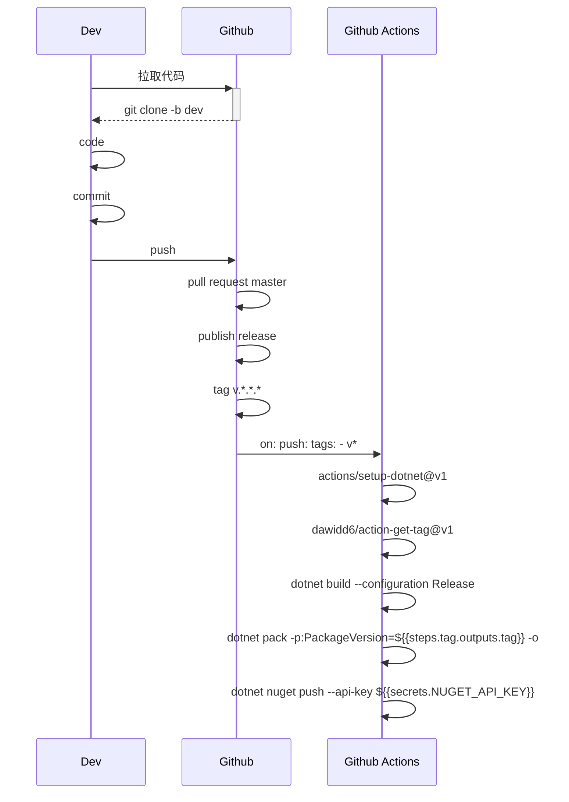

时序图



`.github\workflows`中加入`dotnet.yml`

```yml
name: .NET

on: 
  push:
    tags:
    - v*

jobs:
  build:
  
    runs-on: ubuntu-latest    
    env:
      TZ: Asia/Shanghai
    steps:
    - uses: actions/checkout@v2
    - name: Setup .NET
      uses: actions/setup-dotnet@v1
      with:
        dotnet-version: 6.0.101
    - name: Get Tag
      id: tag
      uses: dawidd6/action-get-tag@v1
      with:
        # Optionally strip `v` prefix
        strip_v: true
    - name: Build with dotnet
      run: dotnet build --configuration Release src/RabbitMQ.EventBus.AspNetCore
    - name: Pack
      run: dotnet pack src/RabbitMQ.EventBus.AspNetCore -c Release --include-symbols --include-source  -p:PackageVersion=${{steps.tag.outputs.tag}} -o artifacts/
    - name: Publish Symbols to NuGet
      run: dotnet nuget push artifacts/*.symbols.nupkg --api-key ${{secrets.NUGET_API_KEY}} --source https://api.nuget.org/v3/index.json
```
开发人员从远程仓库拉取dev分支代码。
开发人员进行开发，并推送分支。
做dev到master分支的拉取请求。
拉取请求合并到master分支后，创建新的release并打标签 `v.*.*.*`。
github actions 的触发方式为打了tag且为v开头的。
下面就是进行编译、获取打的标签、打包、并推送到nuget，版本号就是前面打的tag。