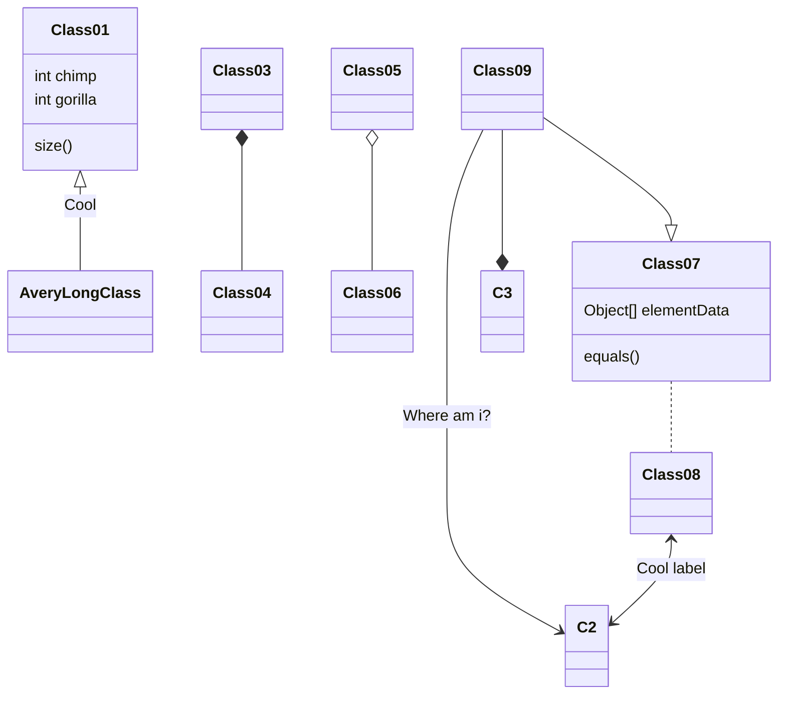

# 项目管理

# Azure DevOps
[Azure DevOps 文档](https://docs.microsoft.com/zh-cn/azure/devops/?view=azure-devops)

# .Net开发

## 设计模式 
[.NET 微服务：适用于容器化 .NET 应用程序的体系结构](https://docs.microsoft.com/zh-cn/dotnet/architecture/microservices/)

[CQRS 模式是什么？](https://docs.microsoft.com/zh-cn/azure/architecture/patterns/cqrs)

[使用 DDD 和 CQRS 模式降低微服务中的业务复杂性](https://docs.microsoft.com/zh-cn/dotnet/architecture/microservices/microservice-ddd-cqrs-patterns/)

[微软的微服务架构示例](https://github.com/dotnet-architecture/eShopOnContainers)

[微软微服务体系](https://docs.microsoft.com/zh-cn/azure/architecture/microservices/)

[设计微服务应用层和 Web API](https://docs.microsoft.com/zh-cn/dotnet/architecture/microservices/microservice-ddd-cqrs-patterns/microservice-application-layer-web-api-design)

[使用 Web API 实现微服务应用层](https://docs.microsoft.com/zh-cn/dotnet/architecture/microservices/microservice-ddd-cqrs-patterns/microservice-application-layer-implementation-web-api)

[事件驱动的架构样式](https://docs.microsoft.com/zh-cn/azure/architecture/guide/architecture-styles/event-driven)

[域事件：设计和实现](https://docs.microsoft.com/zh-cn/dotnet/architecture/microservices/microservice-ddd-cqrs-patterns/domain-events-design-implementation)

[自适应卡片](https://docs.microsoft.com/zh-cn/adaptive-cards/)

[自适应卡片设计器](https://adaptivecards.io/designer/)

[当 DDD 遇上 DCI（Data, Context, Interactive）架构模式](https://www.infoq.cn/article/g6bk78djx_wukxps0kxm)

## .net core 开发
[hangfire](https://docs.hangfire.io/en/latest/index.html)

[identityserver4](https://identityserver4docs.readthedocs.io/zh_CN/latest/index.html)

[MediatR](https://github.com/jbogard/MediatR/wiki)

[ElasticSearch.net API](https://www.elastic.co/guide/en/elasticsearch/client/net-api/6.x/index.html)

[Rabbitmq.Net API](https://www.rabbitmq.com/dotnet.html)

[AutoMapper](https://docs.automapper.org/en/stable/Getting-started.html)

[Ocelot](https://ocelot.readthedocs.io/en/latest/introduction/gettingstarted.html)

[miniprofiler](https://miniprofiler.com/)

[在 ASP.NET Core 中使用托管服务实现后台任务](https://docs.microsoft.com/zh-cn/aspnet/core/fundamentals/host/hosted-services?view=aspnetcore-6.0&viewFallbackFrom=aspnetcore-2.1&tabs=visual-studio#queued-background-tasks)

[使用 ConcurrentBag 创建目标池](https://docs.microsoft.com/zh-cn/dotnet/standard/collections/thread-safe/how-to-create-an-object-pool)

[RulesEngine,微软的规则引擎](https://github.com/microsoft/RulesEngine)

## 部署

[链路追踪](https://help.aliyun.com/document_detail/99880.html)

[Docker](https://docs.docker.com/get-started/)

[K8s](https://kubernetes.io/zh/docs/home/)

[git-scm](https://git-scm.com/book/zh/v2/%E8%B5%B7%E6%AD%A5-%E5%85%B3%E4%BA%8E%E7%89%88%E6%9C%AC%E6%8E%A7%E5%88%B6)

[Azure Repos Git 教程](https://docs.microsoft.com/zh-cn/azure/devops/repos/git/gitworkflow?view=azure-devops)

## 测试

[性能测试](https://benchmarkdotnet.org/)

[xUnit单元测试](https://xunit.net/)

[xUnit单元测试案例](https://www.cnblogs.com/selimsong/p/9306221.html)

[Moq](https://github.com/Moq/moq4/wiki/Quickstart)

[GenFu模拟数据生成](https://github.com/MisterJames/GenFu)

[微软开源的Web测试和自动化](https://playwright.dev/dotnet/docs/intro)

[k6.io 压力测试](https://github.com/grafana/k6)

# Visual Code 插件

## Markmap

[Markmap](https://marketplace.visualstudio.com/items?itemName=gera2ld.markmap-vscode)

[markmap-vscode](https://github.com/gera2ld/markmap-vscode) 是一个将Markdown转换为思维导图的工具。

[Markdown Preview Mermaid Support](https://marketplace.visualstudio.com/items?itemName=bierner.markdown-mermaid) 在MD文件中支持[Mermaid](https://mermaid-js.github.io/mermaid/#/)，Mermaid是一个精美的图表工具

# 设计工具

## slidev 用markdown做ppt

[slidev](https://cn.sli.dev/)

> 有很多功能丰富的、通用的、所见即所得的幻灯片制作工具，例如 微软 PowerPoint 或 苹果 Keynote. 它们在制作带有动画、图表和许多其他漂亮的幻灯片方面效果相当好，同时非常直观和容易学习。那么，为什么要费心制作 Slidev 呢？
>
>Slidev 旨在为开发者提供灵活性和交互性，通过使用他们已经熟悉的工具和技术，使他们的演示文稿更加有趣、更具表现力和吸引力。
>
>当使用所见即所得的编辑器时，人们很容易被样式选项所干扰。Slidev 通过分离内容和视觉效果来弥补这一点。这使你能够一次专注于一件事，同时也能够重复使用社区中的主题。Slidev 并不寻求完全取代其他幻灯片制作工具。相反，它专注于迎合开发者社区的需求。

[文档](https://cn.sli.dev/guide/why.html#slidev)

## mingrammer.com

[https://github.com/mingrammer/diagrams](https://github.com/mingrammer/diagrams)

在Python代码中绘制云系统架构图。用来对新的系统架构设计进行原型设计或者描述现有的系统体系结构。

## Mermaid
[Mermaid](https://mermaid-js.github.io/mermaid/#/)

Mermaid 允许您使用文本和代码创建图表和可视化效果。

它是一个基于Javascript的图表工具，可以呈现Markdown启发的文本定义，以动态创建和修改图表。

# 机器学习

[Microsoft ML.NET 教程](https://docs.microsoft.com/zh-cn/dotnet/machine-learning/tutorials/)

# 游戏&媒体

[在线DOS游戏](https://dos.zczc.cz/)

[一款命令行式哔哩哔哩下载器](https://github.com/nilaoda/BBDown)

[后端架构师技术图谱](https://github.com/xingshaocheng/architect-awesome)
