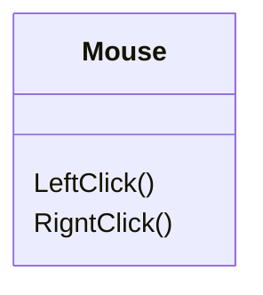

# 实体是什么

实体本身就是一个`class`，一个类，只是它是作为一个对应到现实中的实际个体的类，比如人类，比如猫，在软件开发中则大多对应的是数据库表，在面向对象的设计中，我们大多配合五项基本原则（SOLID）
## 单一职责

单一的职责，这个人就是保安、这个人就是会计、这个人就是保洁，而不是通过if else来判断这个人是做什么的。

## 开放封闭

简单理解，就是我们调用方法的对象都是由接口创建的，我们提供出去的接口可以被重新实现已替换接口的实际内容；或者提供抽象重写的方式。

# 里氏替换

# 依赖倒置

顶部设计不应该依赖底层实现，这个的意思就是顶层设计是键盘，底层实现则是机械键盘、膜键盘，108键键盘，87键键盘；现有键盘才有的不同类型的键盘。

# 接口隔离

还是用上面的键盘举例子，键盘的作用就是打字，所以提供的接口也就是打字的功能，至于机械键盘的可更换键帽、可更换轴这些，如果用户不需要则不应该暴露给用户。

然而大多数的在动手开发前虽然设计的很好，但是往往开发过程中为了加速开发进程就会造成放飞自我的行为导致实体中出现多余内容，虽然也不是不行，但是这就会造成虽然做了架构，但是没有完全做架构的行为对后续的维护交接都会引起一些不可避免的问题。

# 怎么做实体

首先明白了实体是对应现实中的某中实际个体，那么就是明确它有哪些属性，它能做什么；以前流行一种贫血设计模式，就是实体类，只是类，里面只有构造方法，没有其他内容，产生的变更都是通过其他的Service或者Manager进行的。

我们后来的开发中都采用的满血的设计或者说是残血的设计，实体中的属性都是`private set`的，这样保证了外部无法进行更改，我们会提供一个修改该属性的接口来保证属性的变更都是满足限制的，且有的时候进行一个属性的变更可可以直接联动其他的属性变更或者行为；

例如我们常用的鼠标，它的属性包括规格，重量，连接方式等，但是它的行为之后滚轮滚动，左键按下，右键按下；拖动、双击都是由外界的人为产生的而不是鼠标本身的功能

