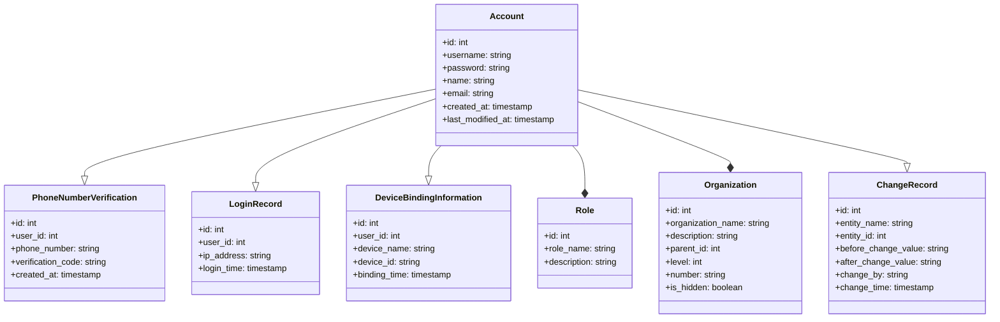
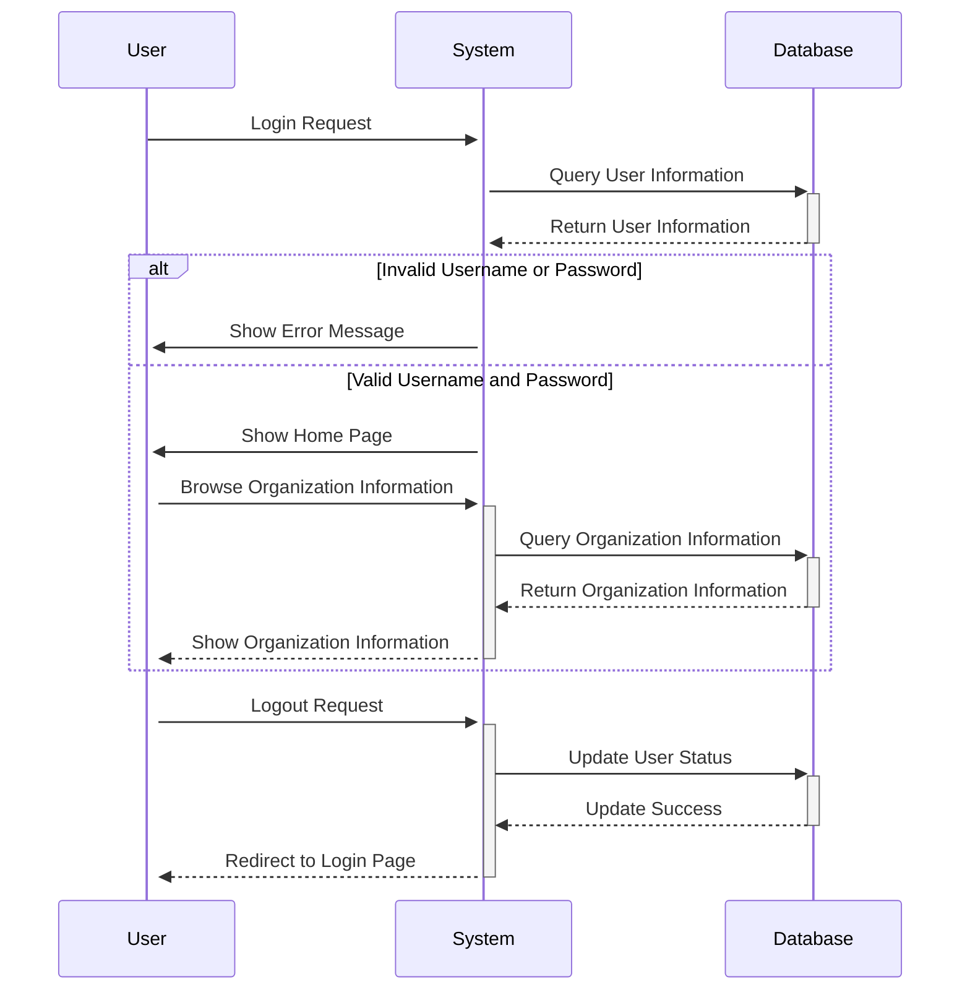

# 用chatgpt做架构设计

## 用户故事

>我们要开发一个系统，我们从用户故事开始，需要设计一个管理系统的模型，其中包括用户账号的基本信息实体，手机号验证实体，登录记录实体，设备绑定信息实体，用户的角色实体，用户的组织机构实体以及变更记录实体。

---

好的，让我帮您分析和设计这个系统。

首先，我们需要了解用户的需求和用户故事，然后根据这些需求和故事设计实体和其属性。基于您提供的信息，我们可以设计出以下实体和其属性：

1. 用户账号实体

- ID
- 用户名
- 密码
- 姓名
- 电子邮件
- 创建时间
- 上次修改时间

2. 手机号验证实体

- ID
- 手机号
- 验证码
- 创建时间

3. 登录记录实体

- ID
- 用户ID
- IP地址
- 登录时间

4. 设备绑定信息实体

- ID
- 用户ID
- 设备名称
- 设备ID
- 绑定时间

5. 用户角色实体

- ID
- 角色名称
· 描述

6. 用户组织机构实体

- ID
- 组织机构名称
- 描述
- 父节点ID

7. 变更记录实体

- ID
- 实体名称
- 实体ID
- 变更前属性值
- 变更后属性值
- 变更人
- 变更时间

以上实体和属性是根据您提供的信息进行设计的。您可以根据具体情况进行调整和完善。

接下来，我们需要根据实体之间的关系设计出模型。以下是一个简单的模型示意图：

在这个模型中，用户账号实体是核心实体，其他实体都是围绕用户账号实体而建立的。手机号验证实体、登录记录实体和设备绑定信息实体都是用户账号的附属信息，用户角色实体和用户组织机构实体则是用于管理用户账号的角色和组织机构信息，变更记录实体用于记录实体属性的变更历史。

希望这个设计可以对您有所帮助。

---

> 用户组织机构实体中还要增加层级、编号、是否隐藏

---

好的，根据您的需求，我们可以将用户组织机构实体的属性扩展为：

1. 用户组织机构实体

- ID
- 组织机构名称
- 描述
- 父节点ID
- 层级
- 编号
- 是否隐藏

这样设计可以更好地支持组织机构之间的层级关系，并且可以通过编号快速定位和查找组织机构。同时，是否隐藏属性可以支持对某些敏感的组织机构进行隐藏和保护。

---

## 数据模型

> 好，将上面的设计转化为数据模型，字段使用英文字段与中文注释，数据库采用postgresql，使用markdown表格的形式来描述输出，并直接给出markdown代码

---

好的，以下是根据您提供的信息设计的PostgreSQL数据库的数据模型。您可以将以下Markdown代码复制到Markdown编辑器中进行查看和编辑。

## 用户账号实体

| 字段名           | 数据类型    | 字段描述     |
| ---------------- | ----------- | ------------ |
| id               | serial      | 用户账号ID   |
| username         | varchar(50) | 用户名       |
| password         | varchar(50) | 密码         |
| name             | varchar(50) | 姓名         |
| email            | varchar(50) | 电子邮件     |
| created_at       | timestamp   | 创建时间     |
| last_modified_at | timestamp   | 上次修改时间 |

## 手机号验证实体

| 字段名            | 数据类型    | 字段描述     |
| ----------------- | ----------- | ------------ |
| id                | serial      | 手机号验证ID |
| user_id           | integer     | 用户账号ID   |
| phone_number      | varchar(20) | 手机号       |
| verification_code | varchar(10) | 验证码       |
| created_at        | timestamp   | 创建时间     |

## 登录记录实体

| 字段名     | 数据类型    | 字段描述   |
| ---------- | ----------- | ---------- |
| id         | serial      | 登录记录ID |
| user_id    | integer     | 用户账号ID |
| ip_address | varchar(20) | IP地址     |
| login_time | timestamp   | 登录时间   |

## 设备绑定信息实体

| 字段名       | 数据类型    | 字段描述       |
| ------------ | ----------- | -------------- |
| id           | serial      | 设备绑定信息ID |
| user_id      | integer     | 用户账号ID     |
| device_name  | varchar(50) | 设备名称       |
| device_id    | varchar(50) | 设备ID         |
| binding_time | timestamp   | 绑定时间       |

## 用户角色实体

| 字段名      | 数据类型     | 字段描述   |
| ----------- | ------------ | ---------- |
| id          | serial       | 用户角色ID |
| role_name   | varchar(50)  | 角色名称   |
| description | varchar(255) | 描述       |

## 用户组织机构实体

| 字段名            | 数据类型     | 字段描述       |
| ----------------- | ------------ | -------------- |
| id                | serial       | 用户组织机构ID |
| organization_name | varchar(50)  | 组织机构名称   |
| description       | varchar(255) | 描述           |
| parent_id         | integer      | 父节点ID       |
| level             | integer      | 层级           |
| number            | varchar(50)  | 编号           |
| is_hidden         | boolean      | 是否隐藏       |

## 变更记录实体

| 字段名              | 数据类型     | 字段描述     |
| ------------------- | ------------ | ------------ |
| id                  | serial       | 变更记录ID   |
| entity_name         | varchar(50)  | 实体名称     |
| entity_id           | integer      | 实体ID       |
| before_change_value | varchar(255) | 变更前属性值 |
| after_change_value  | varchar(255) | 变更后属性值 |
| change_by           | varchar(50)  | 变更人       |
| change_time         | timestamp    | 变更时间     |

以上是一个简单的数据模型示例，您可以根据具体的业务需求进行调整和完善。注意，这里采用了PostgreSQL的数据类型和字段命名方式，您可以根据具体的数据库类型和规范进行调整。

---

## 关系图

> 输出类之间的关系图，用markdown的格式，输出符合Mermaid的脚本代码

---

好的，以下是使用Mermaid的脚本代码，用Markdown输出用户账号实体、用户角色实体、用户组织机构实体之间的关系图：

以上是一个简单的类之间关系图的示例，您可以根据具体的业务需求进行调整和完善。注意，这里采用了Mermaid的语法，您需要将其复制到Mermaid编辑器中进行查看和编辑。

---

## 序列图

> 帮我输出序列图图，用markdown的格式，输出符合Mermaid的脚本代码

---

以下是符合Mermaid的脚本代码，用于输出序列图，您可以将其复制到Mermaid编辑器中进行查看和编辑。

以上是一个简单的序列图的示例，模拟了用户登录系统、浏览组织机构信息和退出系统的过程。您可以根据具体的业务需求进行调整和完善。注意，这里采用了Mermaid的语法，您需要将其复制到Mermaid编辑器中进行查看和编辑。

---

## 状态图

## 产品积压项

> 
使用敏捷开发的形式对这个系统进行产品积压项拆解

---

好的，我们可以使用敏捷开发的形式来对这个系统进行产品积压项拆解。以下是一些可能的产品积压项，您可以根据实际情况进行适当调整和完善。

1. 用户账号管理功能

- 用户账号的创建、修改、删除等基本操作
- 用户密码的加密、解密和重置等操作
- 用户个人信息的编辑和展示功能
- 用户权限管理和角色分配功能
- 用户登录日志和设备绑定信息的记录和查询功能
- 用户账号变更记录的记录和查询功能

2. 手机号验证功能

- 手机号的验证和保存功能
- 手机号的验证码发送和验证功能
- 手机号的修改和删除功能

3. 组织机构管理功能

- 组织机构的创建、修改、删除等基本操作
- 组织机构的层级结构和编号的展示和维护功能
- 组织机构的隐藏和显示功能
- 组织机构成员的添加、删除和查询功能
- 组织机构变更记录的记录和查询功能

4. 角色管理功能

- 角色的创建、修改、删除等基本操作
- 角色的权限分配和管理功能
- 角色成员的添加、删除和查询功能

5. 变更记录管理功能

- 系统各项实体的变更记录的记录和查询功能
- 变更记录的导出和打印功能

以上是一些可能的产品积压项，您可以根据实际情况进行适当调整和完善。在实际开发过程中，可以将这些积压项分解成更小的任务，便于团队成员协作和实现敏捷开发。

---

## 任务拆解

> 对情景用户账号管理功能进行开发任务拆解

---

好的，下面是对情景用户账号管理功能进行开发任务拆解的一些可能的任务：

1. 创建用户账号

- 设计用户账号创建界面和交互流程
- 实现用户账号创建逻辑和数据验证
- 实现用户密码加密和存储逻辑
- 实现用户权限和角色分配逻辑

2. 修改用户账号

- 设计用户账号编辑界面和交互流程
- 实现用户账号编辑逻辑和数据验证
- 实现用户密码修改逻辑和数据验证
- 实现用户权限和角色分配逻辑

3. 删除用户账号

- 设计用户账号删除界面和交互流程
- 实现用户账号删除逻辑和数据验证
- 实现用户相关信息（如登录记录、设备绑定信息、变更记录等）的删除逻辑

4. 用户个人信息管理

- 设计用户个人信息界面和交互流程
- 实现用户个人信息的展示逻辑
- 实现用户个人信息的编辑逻辑和数据验证

5. 用户权限管理

- 设计用户权限管理界面和交互流程
- 实现用户权限和角色分配逻辑
- 实现权限和角色的查询和删除逻辑

6. 用户登录日志和设备绑定信息管理

- 设计用户登录日志和设备绑定信息界面和交互流程
- 实现用户登录日志和设备绑定信息的查询和删除逻辑
- 实现登录日志和设备绑定信息的导出和打印逻辑

7. 用户账号变更记录管理

- 设计用户账号变更记录界面和交互流程
- 实现用户账号变更记录的查询和删除逻辑
- 实现用户账号变更记录的导出和打印逻辑

以上是一些可能的开发任务，您可以根据实际情况进行适当调整和完善。在实际开发过程中，可以将这些任务进一步拆分为更小的子任务，便于团队成员协作和实现敏捷开发。
