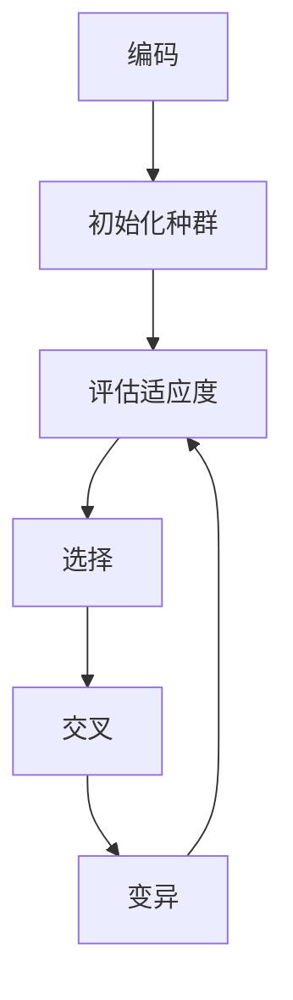

# 什么是遗传算法

遗传算法一般的解释就是模拟达尔文生物进化论和遗传学对生物的进化过程的模拟，用迭代进化的方式得到最优解的方法，其实我了解这个东西有段时间了，但是一直也没有完整的去学习过。

遗传算法的执行过程一般是先有一个`种群`，不论什么东西进化都是从一个种群进化到另一个种群，优胜劣汰，`种群`中的每一个个体都有一组`基因`，也有把这个叫做`染色体`的。

生物都有染色体，他们繁殖出的后代都是从父母双亲的染色体中各取一部分生成一个新的个体。

中间略过……

编码->初始化种群

评估种群中个体适应度->选择->交叉->变异->回到评估

我个人感觉，其中难度最大的是适应度这个地方，
